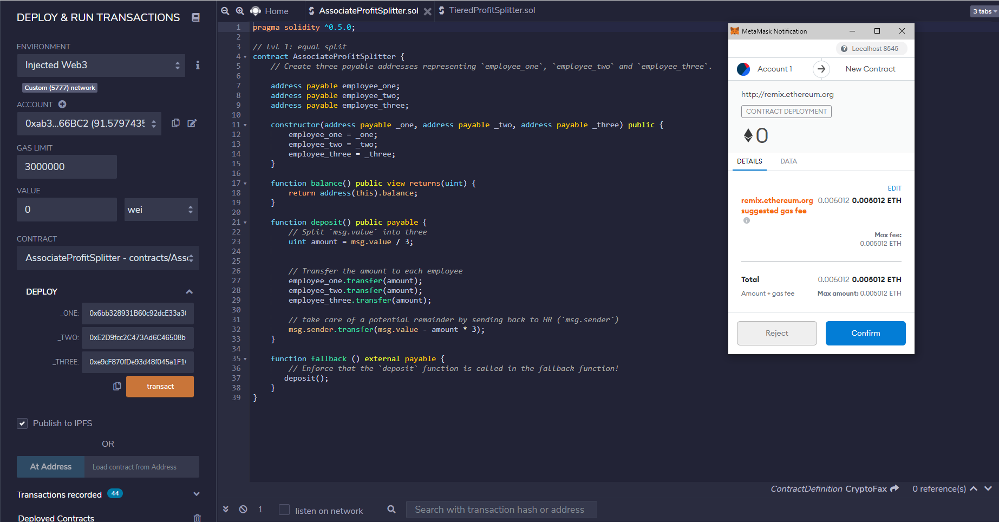
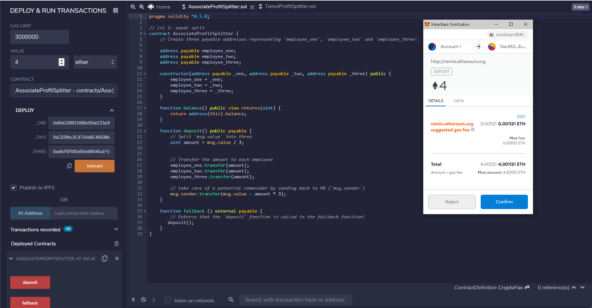
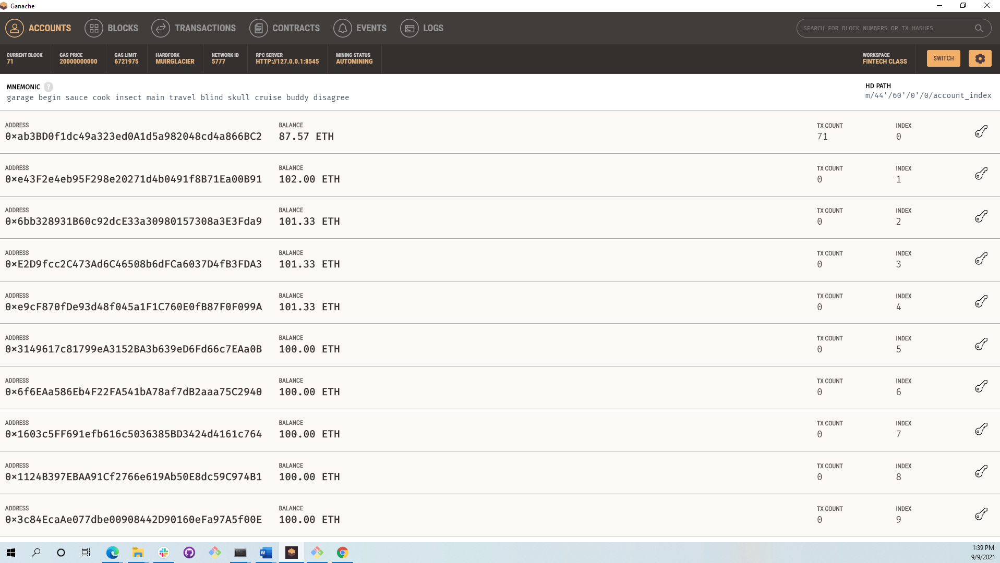
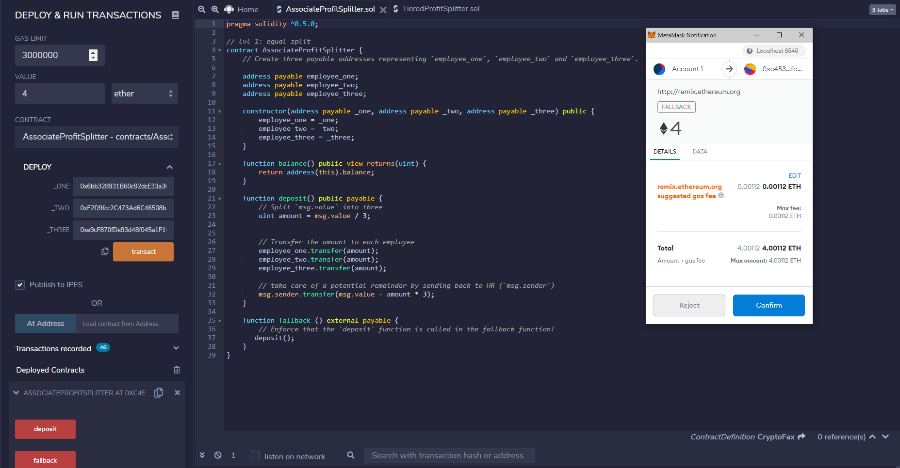
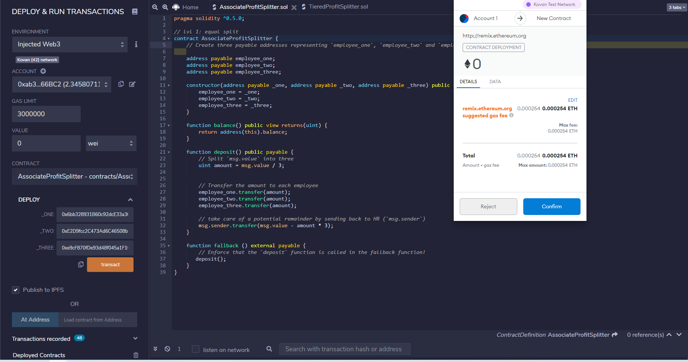
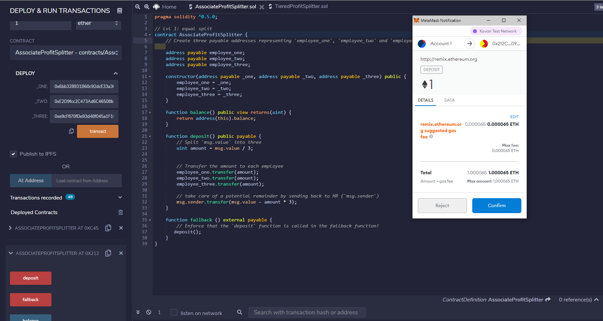
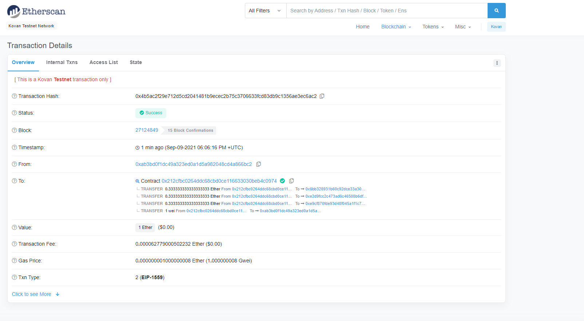

# Solidity Homework #

## "Looks like we've made our First Contract!" ##

For this project, I built a smart contract to automate company finances to make everyone's lives easier, increase transparency, and to make accounting and auditing practically automatic, through an Ethereum-compatible blockchain to help connect financial institutions.

The contract that I created is called AssociateProfitSplitter, which aims to pay the Associate-level employees quickly and easily.

I have used Remix IDE for my code and developed and tested the contract using the Ganache development chain, and pointed MetaMask to Localhost:8545.

The following images show the deployment of the contract and the subsequent tests.

For the next part of the homework, I tested the contract using the Kovan test network.

